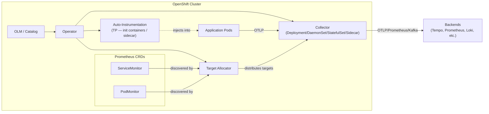
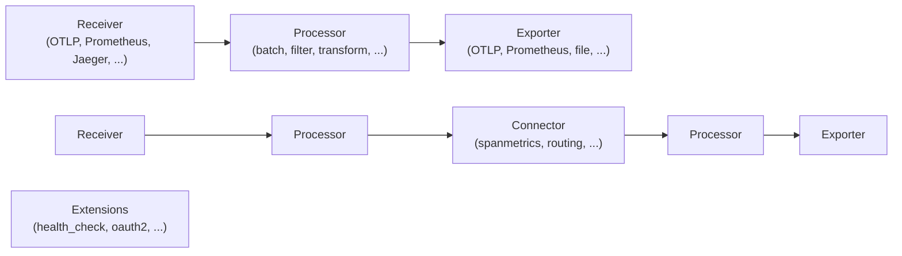
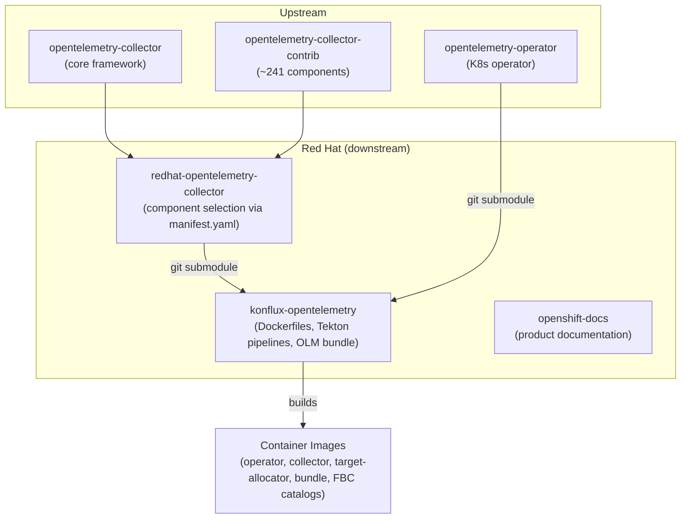

# Architecture

Red Hat build of OpenTelemetry (RHOSDT) is an OpenTelemetry distribution for OpenShift. It provides a supported, FIPS-compliant telemetry pipeline for collecting traces, metrics, and logs from applications and infrastructure.

## System Overview

The product consists of three runtime components deployed on OpenShift via OLM:

- **Operator** (GA) — manages the lifecycle of collectors, auto-instrumentation, and target allocators
- **Collector** (GA) — a vendor-agnostic telemetry pipeline that receives, processes, and exports telemetry data
- **Target Allocator** (GA) — distributes Prometheus scrape targets across collector instances

Auto-instrumentation injection is available as **Technology Preview**.

## Feature Support Levels

Features are classified as:

- **GA** (Generally Available): fully supported with Red Hat production SLAs
- **TP** (Technology Preview): documented but not production-supported, may not be functionally complete
- **Not supported**: present in source code but absent from documentation

Only features documented in the product docs are considered supported. See `.ai/spec/what/collector.md` for per-component support tables.

### Summary (as of RHOSDT 3.10)

| Category | GA | TP | Not Supported |
|---|---|---|---|
| Receivers | 10 | 4 | 0 |
| Exporters | 6 | 6 | 0 |
| Processors | 10 | 4 | 0 |
| Connectors | 1 | 3 | 0 |
| Extensions | 2 | 7 | 1 |
| CRDs | 2 (Collector, TargetAllocator) | 1 (Instrumentation) | 2 (OpAMPBridge, ClusterObservability) |
| Auto-instrumentation languages | 0 | 7 | 0 |

## Collector Pipeline

The collector uses a pipeline architecture where data flows through configurable components:

The Red Hat distro includes ~54 components selected from upstream core and contrib (~300+ available). Of these, 29 are GA and 24 are Technology Preview.

## Repository Structure

## Build Pipeline

1. **Component selection**: `manifest.yaml` in `redhat-opentelemetry-collector` declares which upstream components to include
2. **Code generation**: OpenTelemetry Collector Builder (OCB) generates Go source into `_build/`
3. **Container build**: Konflux/Tekton pipelines build multi-arch (amd64, arm64, ppc64le, s390x) UBI9-based images with FIPS-compliant crypto
4. **Bundle packaging**: upstream OLM bundle is patched with Red Hat metadata via `patch_csv.py`
5. **Catalog generation**: per-OpenShift-version File-Based Catalogs (FBC) for OLM channel resolution

## Key Architectural Decisions

**Declarative component selection**: The Red Hat distro does not fork the collector. Instead, `manifest.yaml` declaratively selects components, and OCB generates the binary. This minimizes divergence from upstream.

**Fork-based workflow**: All contributions go through personal forks, not direct pushes to origin. Squash before merging.

**FIPS compliance**: All Go binaries use `strictfipsruntime` build tags. A post-build FIPS check verifies no non-FIPS crypto functions are linked.

**Multi-version OCP support**: FBC catalogs are generated per OpenShift version (4.12-4.22), allowing version-specific operator compatibility.

**Support level gating**: A feature must be documented in the product documentation to be considered supported. Source code presence alone is insufficient.
